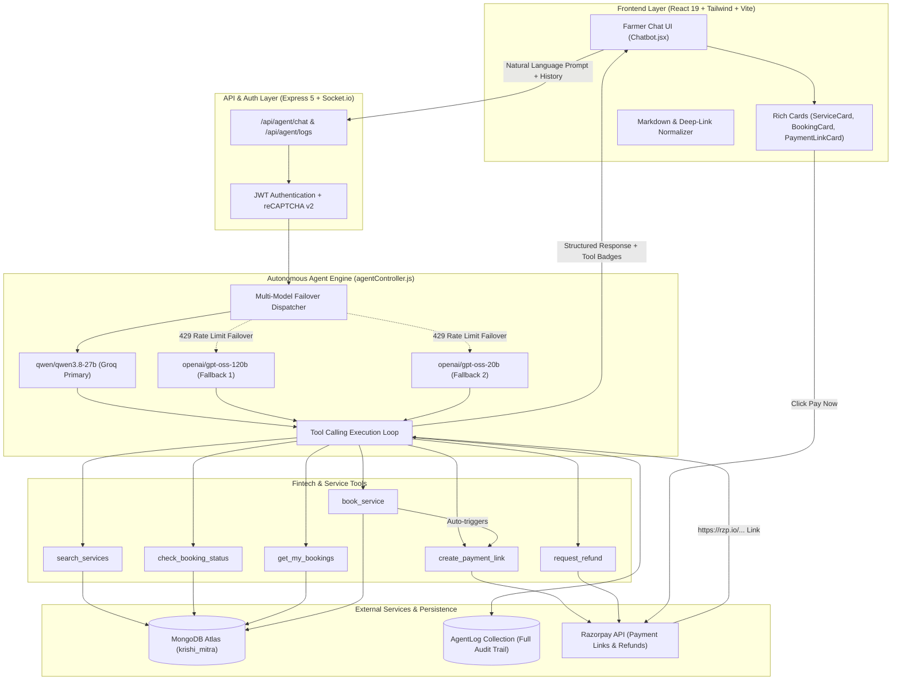

# 🏗️ KrishiMitra AI Agent — System Architecture & Fintech Documentation
**Razorpay Buildathon 2026 — Track 1: Agentic Commerce**

---

## 1. Executive Summary

**KrishiMitra AI Agent** transforms agricultural commerce for India's 140M+ farmers from a complex web-form browsing experience into an **autonomous conversational transaction flow**. 

By orchestrating LLM tool calling (Groq Qwen/GPT models) directly with **Razorpay's Payment Links API** and MongoDB Atlas, a farmer can discover farm machinery, schedule bookings, execute secure payments via `https://rzp.io/...`, and track orders entirely through conversational chat.

---

## 2. High-Level System Architecture



---

## 3. Autonomous Tool Ecosystem

| Tool Name | Parameters | Action | External Integration |
|---|---|---|---|
| `search_services` | `query`, `category`, `location` | Natural language search with case-insensitive regex | MongoDB `Service` collection |
| `book_service` | `serviceId`, `scheduledDate`, `notes` | Creates booking + automatically provisions Razorpay payment link | MongoDB `Booking` + Razorpay API |
| `create_payment_link` | `bookingId`, `farmerName`, `farmerEmail` | Generates a secure, expiring `https://rzp.io/...` link | Razorpay Payment Links API (`/v1/payment_links`) |
| `check_booking_status`| `bookingId` | Retrieves live order, fulfillment & payment status | MongoDB `Booking` & `Payment` |
| `get_my_bookings` | *(Contextual user ID)* | Fetches recent active bookings for the logged-in user | MongoDB `Booking` |
| `request_refund` | `bookingId` | Validates payment status & processes refund | Razorpay Refunds API (`/v1/payments/{id}/refund`) |

---

## 4. Razorpay Integration Deep Dive

### 4.1 Payment Link Provisioning (`create_payment_link`)
Instead of redirecting users to traditional checkout carts, the agent dynamically creates a Razorpay Payment Link:
```javascript
const paymentLink = await rzp.paymentLink.create({
  amount: amountInPaise,
  currency: 'INR',
  accept_partial: false,
  description: `${booking.service.title} - KrishiMitra`,
  customer: {
    name: farmerName || 'Farmer',
    email: farmerEmail || undefined,
  },
  notify: { email: !!farmerEmail },
  reminder_enable: true,
  notes: {
    bookingId: booking._id.toString(),
    source: 'ai_agent',
  },
  callback_url: `${process.env.CLIENT_URL}/bookings`,
  callback_method: 'get',
});
```

### 4.2 Autonomous End-to-End Handshake
1. **Confirmation Gate:** The agent never charges or books without human-in-the-loop consent. It prompts: *"Should I proceed with booking Harvesting for ₹1,200 on 5 Sep?"*
2. **Atomic Execution:** Once confirmed, `bookService` reserves the machinery and immediately calls `createPaymentLink`.
3. **Interactive Widget:** The frontend receives structured payment data and renders both:
   - An inline clickable markdown button (`💳 [Pay ₹1,200 – Harvesting ↗]`).
   - A high-contrast card with service breakdown, total amount, and direct Razorpay checkout redirect.
4. **Refund Processing:** When a booking is rejected by a provider or cancelled, the agent executes `processRefund` to instantly return funds to the source instrument via Razorpay Refunds.

---

## 5. Safety, Auditability & Fault Tolerance

### 5.1 Multi-Model Quota Failover (Zero 429 Errors)
Groq's free tier imposes per-model Rate Limits (RPM/TPM). To prevent user disruptions:
* **Primary:** `qwen/qwen3.8-27b`
* **Failover 1:** `openai/gpt-oss-120b` (separate quota pool)
* **Failover 2:** `openai/gpt-oss-20b` (separate quota pool)
If any model returns HTTP 429, the dispatcher instantly falls back to the next model in milliseconds.

### 5.2 Audit Logging (`AgentLog` Collection)
Every single turn is immutably logged for regulatory and fintech compliance:
```json
{
  "_id": "6a997e82ae16b25075516af9",
  "user": "69de05b7ad7b001163df18be",
  "sessionId": "session_1788444248642",
  "userMessage": "Book the Heavy Tractor Plowing for 5 September",
  "toolCalls": [
    {
      "tool": "book_service",
      "args": { "serviceId": "69de21307bfee33d0d8c10cb", "scheduledDate": "2026-09-05" },
      "result": { "success": true, "bookingId": "6a99b109...", "paymentLinkUrl": "https://rzp.io/rzp/..." },
      "timestamp": "2026-09-04T05:38:21.157Z"
    }
  ],
  "agentResponse": "Your booking is confirmed! Here is your payment link: [Pay ₹12,000](https://rzp.io/...)",
  "provider": "groq",
  "durationMs": 482,
  "createdAt": "2026-09-04T05:38:21.779Z"
}
```

---

## 6. Technology Summary

* **Frontend:** React 19, Tailwind CSS, Framer Motion, Lucide Icons, Vite
* **Backend:** Node.js, Express 5, Socket.io
* **Database:** MongoDB Atlas (Mongoose ODM)
* **AI Tool Orchestration:** Groq Cloud SDK (OpenAI-compatible function calling)
* **Fintech:** Razorpay Node.js SDK (Payment Links API, Orders API, Refunds API)
* **Security:** Google reCAPTCHA v2, JWT, Argon2/Bcrypt hashing
